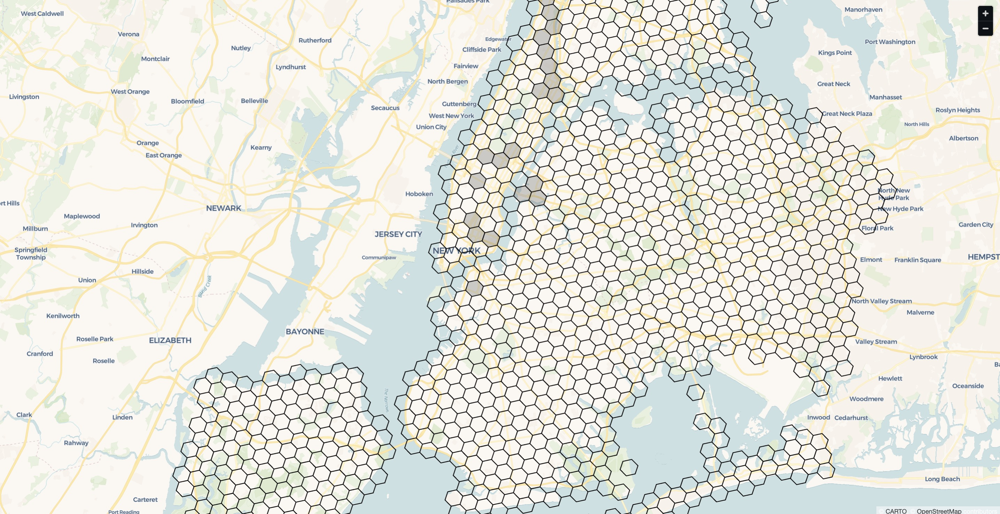

# NYC Rain Crash Risk Dashboard 🌧️🚗

An interactive Streamlit dashboard visualizing heterogeneous treatment effects of rain on NYC crash risk using H3 spatial indexing and causal inference.


---

> ## <p style="text-align: center;">YouTube Demo:</p>
> [](http://www.youtube.com/watch?v=t0mIsWsuVY0)

### <p style="text-align: center;">__Run it live__: https://causalaccidents.streamlit.app/</p>

## 🎯 Overview

This project analyzes how rain affects crash probability across different locations in NYC using:
- **Geospatial Analysis**: H3 hexagonal indexing (resolution 8, ~600m cells)
- **Causal Inference**: T-Learner with Gradient Boosting to estimate Conditional Average Treatment Effects (CATE)
- **Interactive Visualization**: Flat Mercator map showing "kill zones" over NYC streets

> **For detailed information:**  
> - **Complete pipeline documentation** → [`documents/PIPELINE.md`](documents/PIPELINE.md)  
> - **Full analysis results & business insights** → [`documents/HETEROGENEITY_RESULTS.md`](documents/HETEROGENEITY_RESULTS.md)

### Key Findings
- Rain increases crash probability by **0.10pp on average** (0.1013%)
- Effect varies **13.6x across locations** (max 1.38pp in most vulnerable zones)
- High-traffic zones show **3x stronger rain sensitivity** (18x higher traffic than average)
- Top vulnerable cell: `882a100d69fffff` (**885 Lexington Avenue, Upper East Side**)

---

## 🚀 Quick Start

### Prerequisites
- Python 3.12+

### Running the App

```bash
cd CausalAccidents

# Create & activate virtual environment
python -m venv venv
source venv/bin/activate

# Install dependencies
pip install -r requirements.txt

# Start the app
streamlit run src/app.py
```

The app will open at `http://localhost:8501`

---

## 📊 Features

The dashboard has **two main views** accessible via sidebar:

### 🗺️ **Map View** (Default)



**Interactive NYC map with all 1,135 H3 hexagons**

- **Clean Visualization**: All hexagons display with black borders over a street map
- **Selective Highlighting**: Top N highest-risk zones (adjustable 10-200) filled with translucent gray
- **Google Maps-like Controls**: Flat Mercator projection, scroll to zoom, drag to pan
- **Hover Tooltips**: See CATE, traffic, baseline risk, and crash count for any cell
- **Top 5 Quick Reference**: Geocoded addresses for the 5 most vulnerable zones
  - Example: #1 - 885 Lexington Ave (CATE: 1.378%)

---

### 📈 **Analysis & Charts View**


**Comprehensive visual analytics with 4 key charts**

#### 1. **Risk Distribution Histogram**
- Shows how CATE is distributed across all 1,135 cells
- Red dashed line marks Top N cutoff
- Reveals highly-skewed distribution (justifies targeted interventions)

#### 2. **Traffic vs. CATE Scatter Plot**
- Validates 3x traffic amplification effect
- Top 10 zones highlighted as red stars
- Color-coded by risk rank

#### 3. **Top 20 Kill Zones Table**
- Detailed breakdown with geocoded addresses
- Ranks, CATE values, traffic, baseline risk
- Shows multiplier vs. average (e.g., 13.6x for top cell)

#### 4. **Summary Statistics Dashboard**
- Three-panel overview: Targeting, Geography, Impact
- Key metrics and percentiles
- Methodology notes

---

## 📁 Project Structure

```
CausalAccidents/
├── data/
│   ├── cate_by_h3_cells.csv            # Main data (1,135 H3 cells)
│   ├── top_20_geocoded.csv             # Top 20 cells with street addresses
│   ├── nyc_crash_data.csv              # Raw crash data
│   ├── nyc_weather_hourly.csv          # Weather data
│   └── ...                             # Other pipeline outputs
│
├── documents/
│   ├── HETEROGENEITY_RESULTS.md        # Analysis results (must read)
│   └── PIPELINE_SUMMARY.md             # Full pipeline documentation (must read)
│
├── notebooks/
│   ├── 01_data_cleaning.ipynb          # Data cleaning and Feature Engineering (Collisions Data)
│   ├── 02_a_h3_construction.ipynb      # H3 initial construction
│   ├── 02_b_h3_full_construction.ipynb # H3 full panel construction (h3_cell, date, hour)
│   ├── 03_weather.ipynb                # Weather integration
│   ├── 04_causal.ipynb                 # Initial causal analysis
│   ├── 04.5_TLC_data_cleaning.ipynb    # Data cleaning and Feature Engineering (TLC Data)
│   ├── 05_causal_validation.ipynb      # Traffic-adjusted analysis
│   └── 06_CATE.ipynb                   # T-Learner CATE estimation
│
├── src/
│   ├── app.py                          # Main Streamlit dashboard (Map + Analysis views)
│   ├── geocode_top_20.py               # Geocoding script for top 20 H3 cells
│   └── test_map_visual.py              # Test map visualization
│  
├── requirements.txt                    # Python dependencies
└── README.md                           # Project documentation
```

---

## 🔧 Technical Details

### Data Pipeline
1. **Crash Data Cleaning** (`01_data_cleaning.ipynb`)
   - NYPD Motor Vehicle Collisions (2022-01-01 to 2025-10-31)
   - Parse timestamps, filter invalid lat/lon and geographic outliers
   - Extract time features: day_of_week, is_weekend, month, is_rush_hour
   - Output: `crashes_cleaned.csv` (~92% retention rate)

2. **Weather Data** (`03_weather.ipynb`)
   - Open-Meteo Historical Weather API (NYC coordinates)
   - Hourly precipitation and visibility data
   - Binary rain flag: `rain_flag = (precipitation > 0.1mm)`
   - Output: `nyc_weather_hourly.csv` (~33k hours, 8% rain prevalence)

3. **Traffic Data** (`04.5_TLC_data_cleaning.ipynb`)
   - NYC TLC Trip Record Data (Yellow taxi pickups)
   - Polyfill taxi zones to H3 cells with distributed allocation
   - DuckDB optimization for 46 months of parquet files
   - Output: `traffic_h3_2022_2025_polyfill.parquet` (~1,500 cells)

4. **Initial H3 Panel** (`02_a_h3_construction.ipynb`)
   - Apply H3 resolution 8 indexing to crashes (~600m hexagons)
   - Aggregate to (h3_cell, date, hour) with crash counts
   - Dense panel: cells with ≥1 historical crash
   - Output: `h3_panel_res8.csv` (~1,500 unique cells)

5. **Full Panel Construction** (`02_b_h3_full_construction.ipynb`)
   - Cartesian product: H3_cells × Dates × Hours (avoid selection bias)
   - Merge crash counts (fill zeros), weather, and compute Baseline_Risk
   - Rolling 30-hour average crash rate per cell (lag-adjusted)
   - Output: `h3_full_panel_res8.csv` (~40M observations)

6. **Causal Inference - Initial ATE** (`04_causal.ipynb`)
   - DoWhy framework with backdoor adjustment
   - Propensity score weighting for average treatment effect
   - Confounders: time features, Baseline_Risk, Traffic_Proxy
   - Result: ATE ≈ 0.091pp, robustness checks passed

7. **Causal Validation - Real Traffic** (`05_causal_validation.ipynb`)
   - Replace Traffic_Proxy with actual TLC traffic_count
   - Re-estimate ATE with real exposure data
   - Result: ATE ≈ 0.095pp (validates initial estimate)

8. **Heterogeneous Effects** (`06_CATE.ipynb`)
   - T-Learner with GradientBoostingRegressor (100 trees, depth=5)
   - Stratified sampling: 1M observations (500k rain / 500k no-rain)
   - Features: log_traffic, Baseline_Risk, temporal covariates
   - Training time: ~56 seconds, spatial aggregation to 1,135 cells
   - Output: `cate_by_h3_cells.csv` (mean, median, std per cell)

### Model Details
- **Algorithm**: T-Learner (two separate models for treatment/control)
- **Base Learner**: GradientBoostingRegressor (100 estimators, max_depth=5)
- **Features**: log_traffic, baseline_risk, day_of_week, is_weekend, month, is_rush_hour
- **Training Time**: ~56 seconds total
- **Sample Size**: 1M stratified sample

---

## 📈 Results Summary

From `HETEROGENEITY_RESULTS.md`:

| Metric | Value |
|--------|-------|
| **Mean CATE** | 0.001013 (0.10pp) |
| **Std CATE** | 0.000732 |
| **Max CATE** | 0.013775 (1.38pp) |
| **Total H3 Cells** | 1,135 |
| **High-traffic effect** | 0.19pp (~3x average) |
| **Low-traffic effect** | 0.07pp |

### Recommendations
1. **Target high-CATE zones** (top 10%) with 2x surge pricing + safety alerts
2. **Sunday rain events**: Pre-position drivers, proactive warnings (1.6x higher risk)
3. **Low-CATE zones**: Standard operations (maintain competitiveness)

---

## 🚧 Future Enhancements

- [x] ~~Geocoding integration (H3 → street addresses)~~ **DONE**
- [ ] Real-time CATE scoring API
- [ ] Historical back-testing dashboard  
- [ ] Multi-city support (Chicago, LA, SF)
- [ ] Driver positioning optimization algorithm
- [ ] Live weather forecast integration
- [ ] A/B test deployment framework

---

## 📚 References

- **H3 Spatial Indexing**: [Uber H3](https://h3geo.org/)
- **Causal Inference**: [DoWhy](https://www.pywhy.org/dowhy/v0.14/)
- **Data Sources**:
  - [NYPD Motor Vehicle Collisions](https://data.cityofnewyork.us/Public-Safety/Motor-Vehicle-Collisions-Crashes/h9gi-nx95)
  - [NYC TLC Trip Data](https://www.nyc.gov/site/tlc/about/tlc-trip-record-data.page)
  - [Open-Meteo Weather API](https://open-meteo.com/)

---
